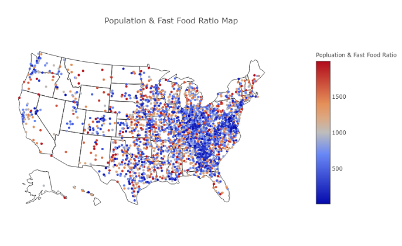

# Web Visualization & Dashboard (Food Environment Web Page)
Rooted with Food-Enviroment-Project

## Background

Data is more powerful when we share it with others! We are taking what we learned about HTML and CSS to create a dashboard showing off the analysis we've done (in the Food-Enviroment-Project).

## Latitude Analysis Dashboard with Attitude

In this challenge, we create a visualization dashboard website using visualizations we've created in the Food-Enviroment-Project.

In building this dashboard, we create individual pages for each plot and a means by which we can navigate between them. These pages will contain the visualizations and their corresponding explanations. We'll also have a landing page, a page where we can see a comparison of all of the plots, and another page where we can view the data used to build them.

### Website 

The website consists of 7 pages total, including:

* A landing page containing:
  * An explanation of the project.
  * Links to each visualizations page.
* Four visualization pages, each with:
  * A descriptive title and heading tag.
  * The plot/visualization itself for the selected comparison.
  * A paragraph describing the plot and its significance.
* A "Comparisons" page that:
  * Contains all of the visualizations on the same page so we can easily visually compare them.
  * Uses a bootstrap grid for the visualizations.
* A "Data" page that:
  * Displays a responsive table containing the data used in the visualizations.

The website has a navigation menu that:

* Has the name of the site on the left of the nav which allows users to return to the landing page from any page.
* Contains a dropdown on the right of the navbar named "Plots" which provides links to each individual visualization page.
* Provides two more links on the right: "Comparisons" which links to the comparisons page, and "Data" which links to the data page.
* Is responsive (using media queries). The nav has similar behavior as the screenshots (notice the background color change).

Finally, the website is deployed to GitHub pages. Feel free to check it out yourself!

[Food Environment Project](https://normanlo4319.github.io/Food-Environment-Web-Page/)

Copyright © 2020 Norman Lo
